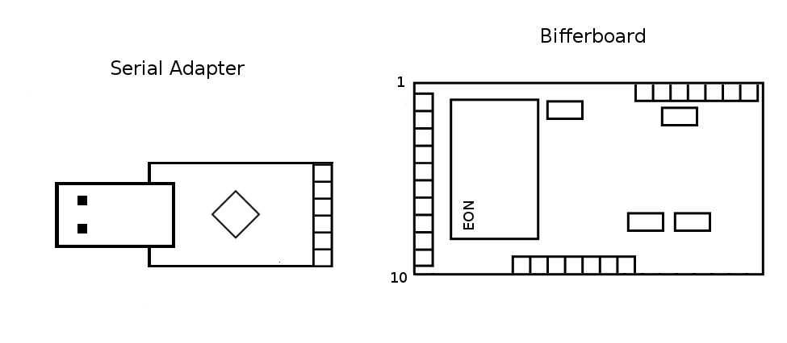

 
 This JTAG software is copyright (c) 2021 Bifferos.com.

 Permission is hereby granted, free of charge, to any person obtaining a copy
 of this software to deal in the software without restriction, including
 the rights to copy, publish, distribute sublicense, and/or sell copies of the
 software and to permit persons to whom the software is furnished to do so,
 subject to the following conditions:

 THE SOFTWARE IS PROVIDED 'AS IS', WITHOUT WARRANTY OF ANY KIND, EXPRESS OR
 IMPLIED, INCLUDING BUT NOT LIMITED TO THE WARRANTIES OF MERCHANTABILITY,
 FITNESS FOR A PARTICULAR PURPOSE AND NONINFRINGEMENT. IN NO EVENT SHALL THE
 AUTHOR OR COPYRIGHT HOLDER BE LIABLE FOR ANY CLAIM, DAMAGES OR OTHER LIABILITY,
 WHETHER IN AN ACTION OF CONTRACT, TORT OR OTHERWISE, ARISING FROM, OUT OF OR IN
 CONNECTION WITH THE SOFTWARE OR THE USE OR OTHER DEALINGS IN THE SOFTWARE.

 Intro

 Biffjtag allows programming of one Bifferboard using the JTAG pins of a
 second as GPIO.

 Required

 One original unmodified Bifferboard with R19 intact (JTAG enabled)
 One modified Bifferboard with R19 removed (JTAG disabled so pins can be
 used as GPIO.  See:  
   https://sites.google.com/site/bifferboard/Home/howto/convert-jtag-pins-to-gpio

 Wiring is simple:  Connect pins 2-6 on the 10 way connector to pins 2-6 on
 the second board, basically 4 data lines, and one ground.

 

 